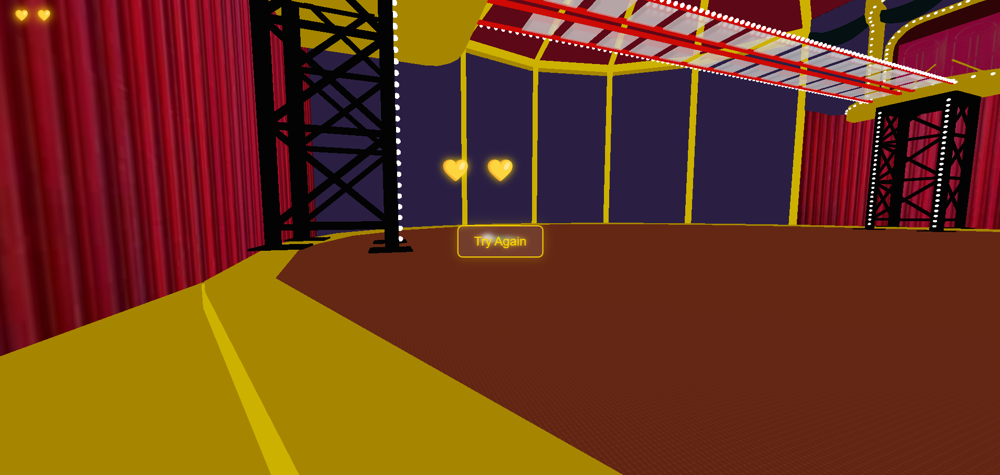

# Squid Game Glass Bridge Challenge

A thrilling recreation of the iconic Glass Bridge challenge from Squid Game, built with Three.js. Test your luck and skills as you attempt to cross the bridge by choosing the right glass panels.

## Game Preview

<div align="center">
  <div style="display: grid; grid-template-columns: repeat(2, 1fr); gap: 10px;">
    
    
    
    
  </div>
</div>

## Features

- Realistic glass bridge simulation
- Dynamic glass breaking effects
- Immersive sound effects
- Lives system
- Responsive controls

## How to Play

1. Choose your path carefully - one wrong step and the glass will break!
2. You have 3 lives to complete the challenge
3. Time your jumps and make it to the end

## Setup
Download [Node.js](https://nodejs.org/en/download/).
Run these commands:

```bash
# Install dependencies (only the first time)
npm install

# Run the local server at localhost:8080
npm run dev

# Build for production in the dist/ directory
npm run build
```

## Live Demo

Try the game here: [Play Squid Game Glass Bridge](https://nakulbhaliya.github.io/squid-game/)

## Credits

- Inspired by Netflix's Squid Game series
- Built with Three.js Journey course fundamentals
